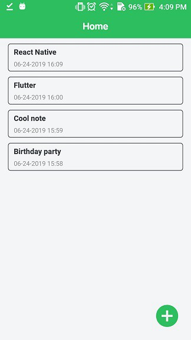
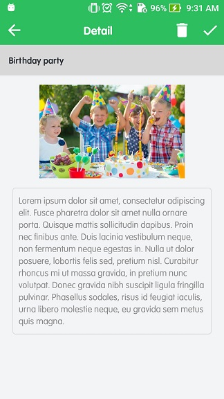
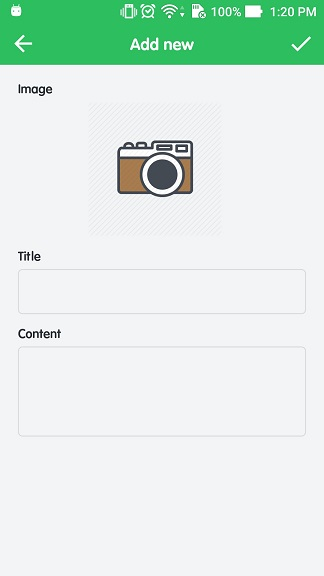

# Making a simple note app with PouchDB in React Native

## Description:
* Can working with slow or no network connection.
* Synchronization between devices and server when going online (with actions like creating, reading, updating, deleting notes).
* Watch the video demo to clearly: https://www.youtube.com/watch?v=qT2Is58aZsQ
* Check my general guidance to know more and how to do it: https://medium.com/@duytq94/making-a-simple-note-app-with-pouchdb-in-react-native-ec4810b18a42

## Screenshots:

 
 
 
